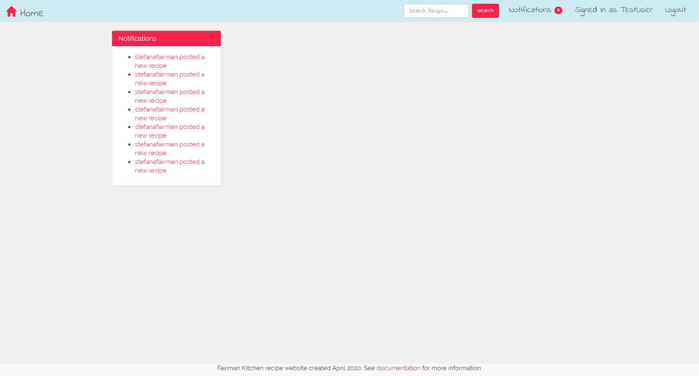
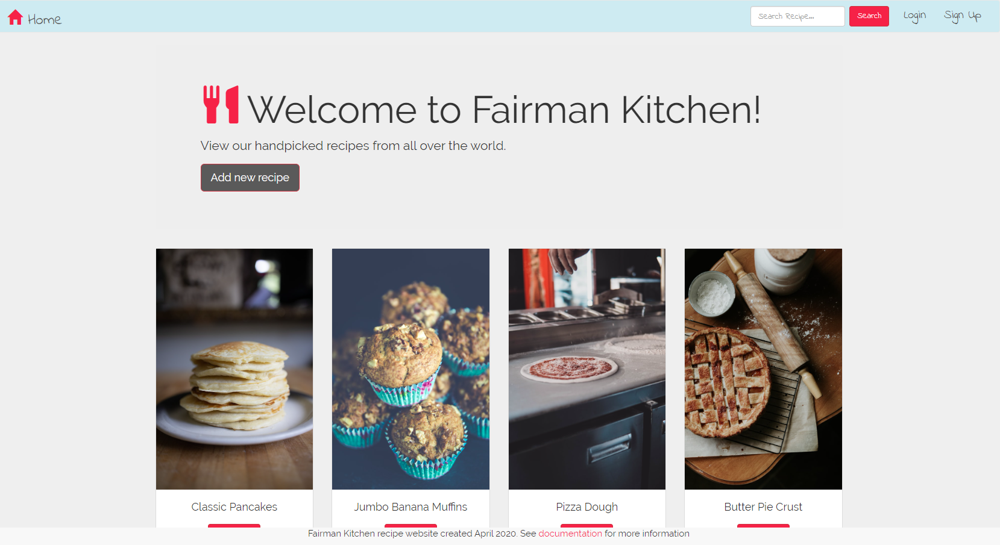
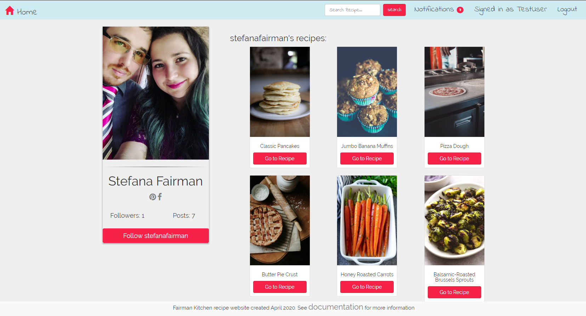

# FairmanKitchen
> This recipe website hosts a databse of user-generated recipes!

## General info
After registering, a user can create new recipes, comment on recipes, follow other users and receive notifications. Website users that are not registered can still search the database and view the recipes, but they cannot comment or follow other users.

## Tools and Technologies
* HTML5
* CSS3
* Bootstrap 3
* JavaScript
* jQuery
* NodeJS
* NPM
* ExpressJS
* REST
* MongoDB
* PassportJS
* Authentication and Authorization

## Demo
You can demo the app here: http://fairmankitchen.ddns.net/

## Features
List of features ready and TODOs for future development
* Notifications - after following a user, the new recipes posted by said user will appear on your notification page and the badge count will increase.

* Main Page - lists all the current recipes in the database and has a Fuzzy Search implementation.

* User Profile - shows the user's added recipes, profile card with links to Pinterest and Facebook, number of followers, number of posts, and a Follow button.

To-do list:
* Implement Search Filters
* Implement Search by Category and Search by Ingredient

## Status
Project is: _in progress_ 
Updates and maintenance will continue to be made to the website.

## Inspiration
Project inspired by Colt Steele, Udemy Instructor. After taking the course titled: The Web Developer Bootcamp and working on a similar production application called YelpCamp, I wanted to re-design it and make it more personal by building a simple recipe website.

Extra features such as notifications, followers, user profile, and password reset were inspired by Ian Schoonover and his YouTube channel: https://www.youtube.com/user/13rOzProductions/videos 

Images (landing page, and recipe images) are either original photos or free photos taken from Unsplash.

## Contact
Created by [@stefanafairman]. You can contact me at fairmankitchen@gmail.com
